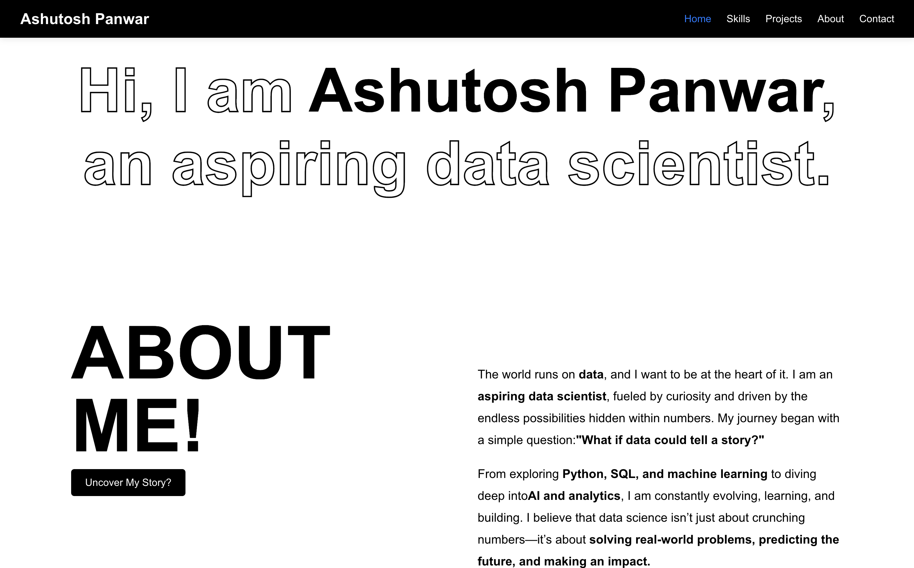
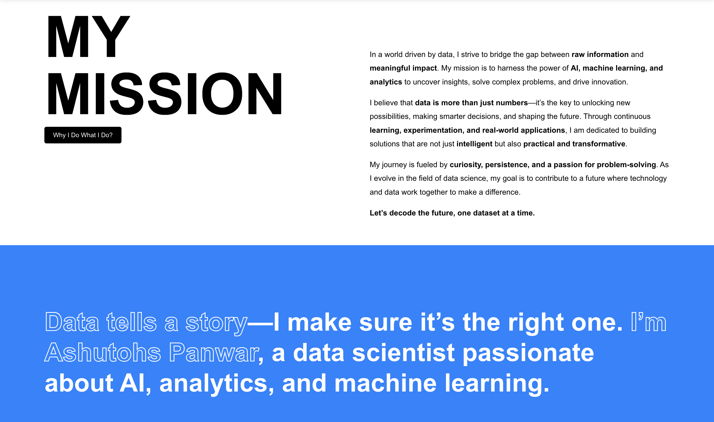
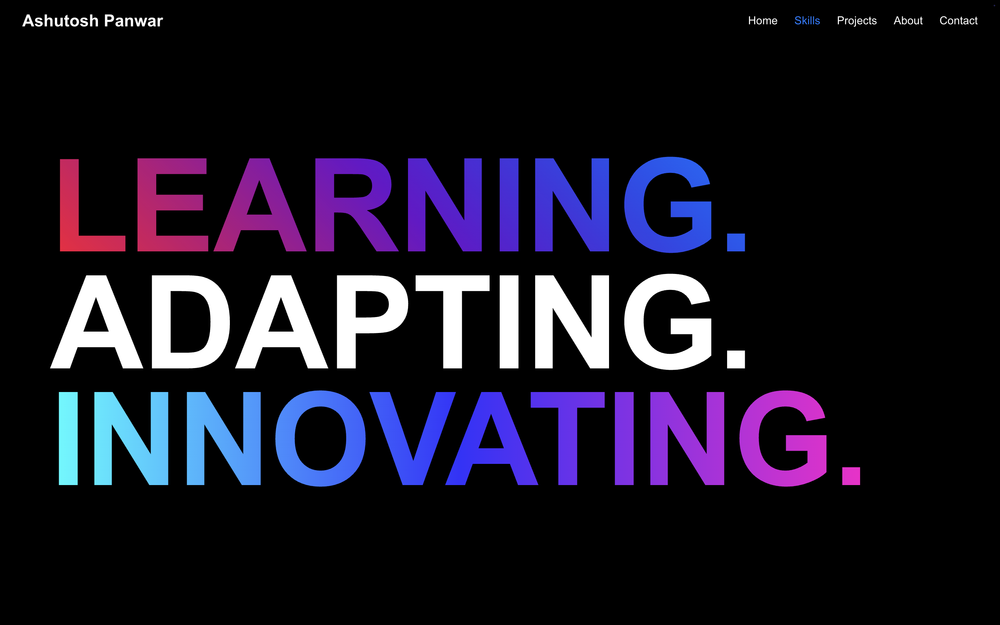
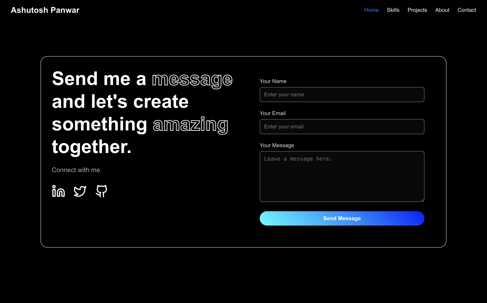

<h1 align="center"> 🔥 Mr.Panwar Portfolio 🔥</h1>

<p align="center">
  
</p>
Step into my world of Data Science! This portfolio is a fusion of innovation and design, built with state-of-the-art UI/UX to provide a visually stunning and intuitive experience. Designed for seamless navigation, it brings my work, skills, and journey to life.

## 🔥 Live Portfolio

👉 **[Visit My Portfolio](https://mr-panwar.web.app/)** 🚀

## 🖼️ Preview

### 🎨 Homepage

<p align="center">
  
</p>
<p align="center">
  
</p>

### 🏆 My Skills

<p align="center">
  
</p>
<p align="center">
  
</p>

### ⭐️ Contact Page

<p align="center">
  
</p>

## 🚀 Key Features

-   **Visually Stunning Design** – A modern, sleek dark theme that stands out.
-   **Lightning-Fast Performance** – Optimized for speed and efficiency.
-   **Fully Responsive** – Seamlessly adapts to any device.
-   **Interactive Project Showcase** – Highlights my best work with visuals and details.
-   **Skill & Tech Stack Overview** – Showcasing my expertise in **Python, SQL, ML, AI**, and more.
-   **Contact & Social Links** – Easy access to connect with me.
-   **Future-Proofed** – Scalable architecture for adding new features.

## 🛠️ Tech Stack

-   **Frontend**: React.js
-   **Hosting**: Firebase (optimized for performance)
-   **Animations**: Framer Motion for smooth UI transitions

## 📂 Project Structure

```
portfolio/
│── public/
│── src/
│   │── components/
    |   ├── Certf
    │   │   ├── Certificate.css
    │   │   └── Certificate.js
    │   ├── Footer
    │   │   ├── Footer.css
    │   │   └── Footer.js
    │   ├── Form
    │   │   ├── Form.css
    │   │   └── Form.js
    │   ├── Hobbies
    │   │   ├── Hobbies.css
    │   │   └── Hobbies.js
    │   ├── Navbar
    │   │   ├── Navbar.css
    │   │   └── Navbar.js
    │   ├── Project-Home
    │   │   ├── Prj.css
    │   │   └── Prj.js
    │   ├── TalkComponent.css
    │   ├── TalkComponent.js
    │   └── skl
    │       ├── Skill.css
    │       └── Skill.js
│   │── pages/
    │   ├── About
    │   │   ├── About.css
    │   │   └── About.js
    │   ├── Contact
    │   │   ├── Contact.css
    │   │   └── Contact.js
    │   ├── Home
    │   │   ├── Hero.css
    │   │   └── Hero.js
    │   ├── Projects
    │   │   ├── Projects.css
    │   │   └── Projects.js
    │   └── Skills
    │       ├── Skills.css
    │       └── Skills.js
│── README.md
```

<!-- ## 🎯 Future Enhancements

-   **AI-Powered Resume Analysis** – Smart insights on my skillset.
-   **Personalized Project Recommendations** – Based on user interests.
-   **A Fully Functional Blog** – Sharing knowledge & experiences.
-   **More Animations & Interactions** – For an even better user experience. -->

## 🚀 Getting Started (For Local Installation)

1. **Clone the repository**:
    ```sh
    git clone https://github.com/your-username/your-portfolio.git
    ```
2. **Navigate to the project directory**:
    ```sh
    cd your-portfolio
    ```
3. **Install dependencies**:
    ```sh
    npm install
    ```
4. **Start the development server**:
    ```sh
    npm start
    ```
5. **Open `http://localhost:3000` in your browser**.

## 📬 Let's Connect!

If you're interested in collaborating, feel free to reach out!

-   **🌐 Portfolio**: [mr-panwar.web.app](https://mr-panwar.web.app/)
-   **💼 LinkedIn**: [Your LinkedIn](https://www.linkedin.com/in/ashutoshpanwar1100/)
-   **🐙 GitHub**: [Your GitHub](https://github.com/AshutoshPanwar)

---

## If you like my work, drop a star on the repo! ♥️**
